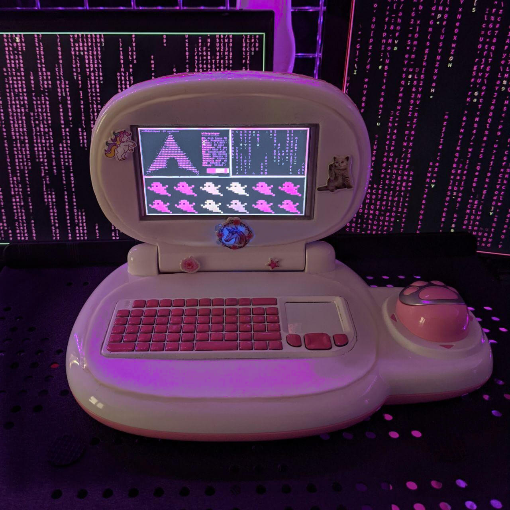
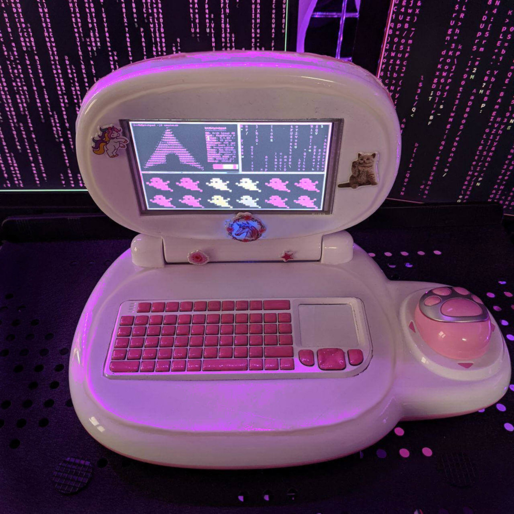
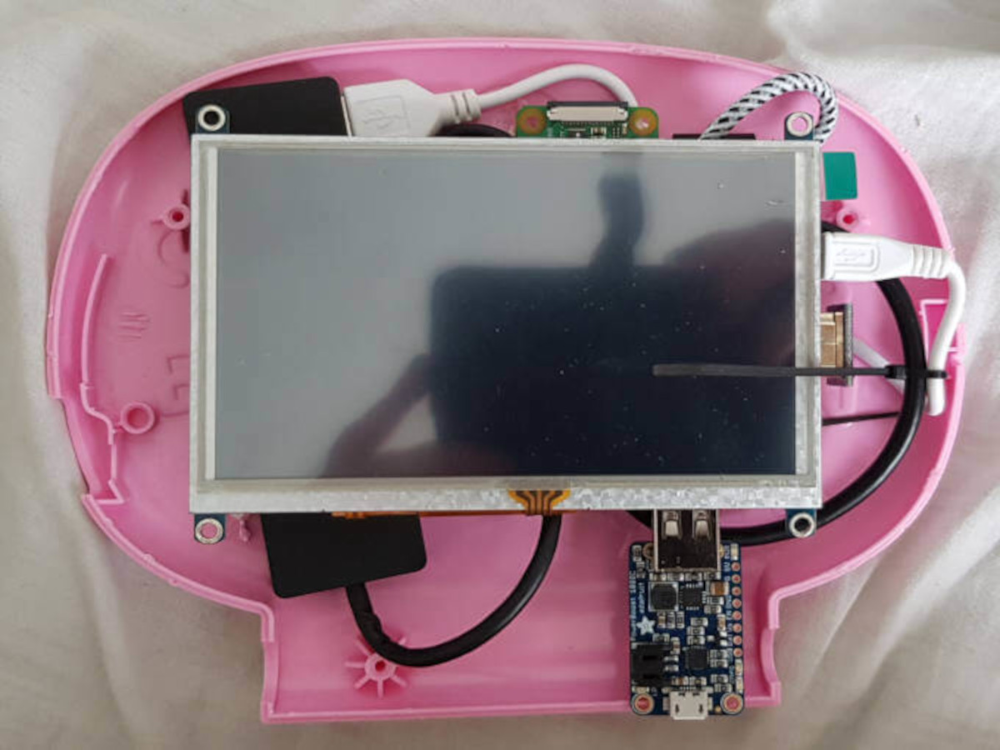
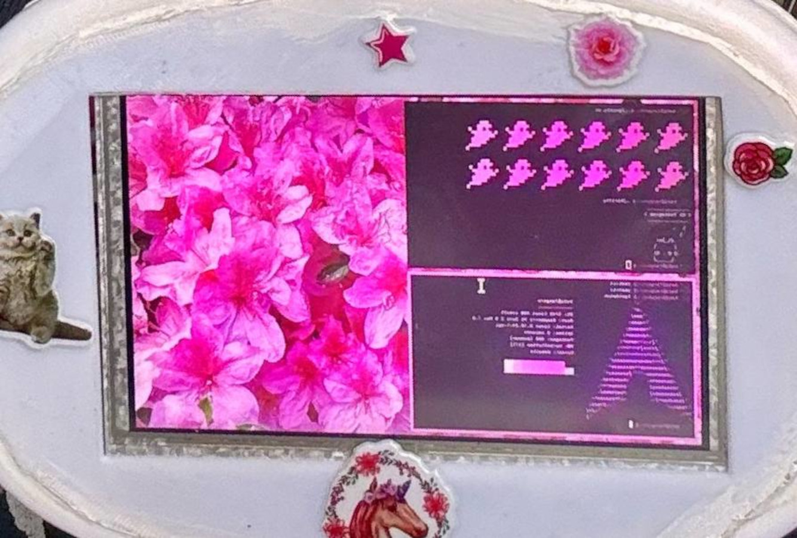

# PinkPad



*The most black metal toy laptop out there running Arch Linux.*

PinkPad started life as a children’s learning laptop and ended up as a fully functional tiny Linux machine because apparently I looked at a pink toy computer during lockdown and thought:

> “yeah, that needs Arch Linux.”

So that’s exactly what happened.

The full (minimally) chaotic write-up, hardware details, software setup, assembly process, and mistakes live on my blog:

➡️ Full build log: https://missmolerat.com/posts/pinkpad/
---

## Is the PinkPad a cyberdeck or not?

Per definition, I’d say it very much is.

Back when I originally built it though, I intentionally avoided the term for a few reasons:

- at the time cyberdecks were often very “tactical”, rugged and “hacker bro” coded aesthetically, I wanted something pink, playful and unapologetically girly instead, and I also wanted it to maybe appeal to other girls who normally wouldn’t see themselves in that space
- many cyberdecks also felt more like cyberpunk art objects than practical computers: absolutely cool looking, but often bulky, fragile or not really meant for long-term everyday use
- my actual motivation was simply wanting one of those tiny mini laptops/netbooks that suddenly became popular early pandemic, but during lockdown they were either unavailable or absurdly expensive

So back then I avoided the word.

Nowadays though the cyberdeck scene has become way broader and way more creative, and thankfully no longer feels nearly as narrow as it used to.

So yes: nowadays I’m perfectly comfortable calling the PinkPad a cyberdeck, too.
---

# Gallery

<table>
<tr>
<td width="50%">

</td>
<td width="50%">

</td>
</tr>

<tr>
<td width="50%">

</td>
<td width="50%">

</td>
</tr>
</table>


# What is this?

PinkPad is a heavily modified toy laptop based on:

- Raspberry Pi Zero W (v2 with Zero 2 W, Arch Linux Arm dropped their armv6 support :( )
- 5" touchscreen display
- Rii wireless keyboard
- Way too much glue
- Pink nail polish, obviously

The original shell came from a toy learning laptop and was modified to fit actual hardware inside.
You find the STLs for this modification in this repo.

It is tiny.  
It is impractical.  
It is Black Metal.

And yes, it runs Arch, btw.

---

# Highlights

- Fully functional Arch Linux system
- WiFi
- herbstluftwm
- emacs of course
- my weird touch keyboard hack
- fully functional paw mouse (STLs + code for my "original PCB disappeared so lets 3D print one" follow)

---

# Hardware

Main components used:

- Raspberry Pi Zero W (or Zero 2, any Pi if you use the printed middle part)
- 5" LCD touch display
- Rii X1 mini wireless keyboard
- LiPo + Boost (or USB powerbank in case you fried your boost just like I did...)
- Random wires from the cable dimension

The exact parts, assembly notes, and build process are documented in the blog post above.

---

# WIP: Repository Contents

WIP! I was completely surprised this project gained attention six years after its birth, so have some patience, detailed configs and docs follow ;)

```text
.
├── pics/        # README images
├── pink_paw/    # paw mouse code and configs
├── docs/        # Additional notes
└── misc/        # Random supporting files
```

# As Seen In

A wonderful article and collection of cyberdecks and DIY computing
projects that, imho, really captures the spirit of the
cyberdeck community:

- MAKE  
  https://makezine.com/article/technology/computers-mobile/destroy-big-tech-with-a-salvaged-cyberdeck/

## PinkPad Articles

- Hackster.io  
  https://www.hackster.io/news/this-pink-toy-laptop-is-actually-a-fully-functional-arch-linux-machine-53caac3c2b39

- Adafruit Blog  
  https://blog.adafruit.com/2026/05/13/turning-a-toy-into-a-linux-cyberdeck-with-raspberry-pi/

- Hackaday  
  https://hackaday.com/2026/05/13/vtech-toy-becomes-pinkpad-the-diy-linux-laptop/